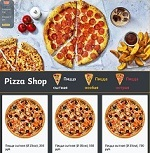
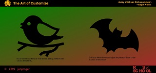
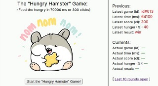
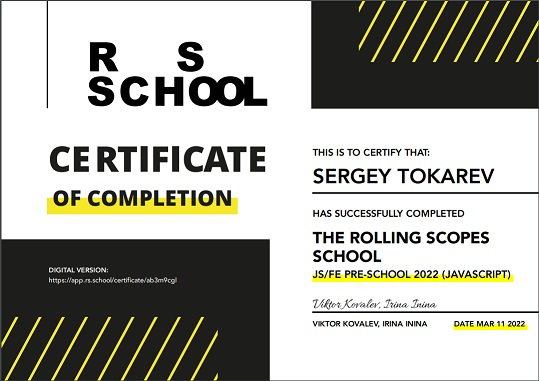

# Sergey Tokarev (*@junproger*)

> «The Code can break down the System»


## Contacts

- Github: [@junproger](https://github.com/junproger/)

- Hackr.io: [@junproger](https://hackr.io/junproger)

- Codewars: [@junproger](https://www.codewars.com/users/junproger)


- Discord: ```Jun Proger #2774```

- E-mail: junproger@gmail.com

- Website: [My Website](http://end407.byethost7.com/)

## About Me

> Greetings! I have a college degree in economics and worked in Internet marketing for a while. Web development interested me as a hobby at the time. But the moment came when I saw more opportunities in a web development. A wise man once told me that: "*a people can to write code — the code can break down the system*". Then I decided to become a web developer and started studying at RS School.
>
> **Welcome to Web Development with RS School!**

## My Skills

1. **`GNU/LINUX`** &#x2B50; &#x2B50; &#x2B50;

2. **`GIT + MKDW`** &#x2B50; &#x2B50; &#x2B50; &#x2B50;

3. **`HTML + CSS`** &#x2B50; &#x2B50; &#x2B50; &#x2B50; &#x2B50;

4. **`JAVASCRIPT`** &#x2B50; &#x2B50; &#x2B50; &#x2B50;

5. **`AJAX + JSON`** &#x2B50; &#x2B50; &#x2B50;

6. **`PHP + MYSQL`** &#x2B50; &#x2B50;

## Code Examples

[The code of Kata "Find the Slope" from CodeWars (8kyu)](https://www.codewars.com/kata/55a75e2d0803fea18f00009d)

```javascript
function slope(points) {
    let M = (points[3] - points[1])/(points[2] - points[0]);
        if (isFinite(M) === false) {
            M = undefined;
            } else {
            M = Math.floor(M);
            }
        return String(M);
}
```

[The code of coins change from the "Best Coffee Automat"](http://end407.byethost7.com/olders/jscoffee/jscoffee.html)

```javascript
// coins change function
function getChange() {
    let sizeTrayChange = document.querySelector('#trayChange');
    let coordTrayChange = sizeTrayChange.getBoundingClientRect();
    let widthTrayChange = trayRandom(150, sizeTrayChange.offsetWidth);
        console.log('widthTrayChange: ' + widthTrayChange);
        if (outchanges < 9) return false;
            else if (outchanges >= 200) changecoin = 200;
            else if (outchanges >= 100) changecoin = 100;
            else if (outchanges >= 50) changecoin = 50;
            else if (outchanges >= 10) changecoin = 10;
            document.querySelector('#trayChange').innerHTML += ``;
            console.log('changecoin = ' + changecoin);
            outchanges -= changecoin;
                if (outchanges !== 0) {
                getChange()
                }
                    else {
                    outchanges = 0;
                    changecoin = 0;
                    console.log(outchanges);
                    console.log(changecoin);
                    }
}
```

[The code of AJAX request & JSON response from the "Pizza Shop"](http://end407.byethost7.com/olders/cardclass/cardclass.html)

```javascript
// calling ajax format
const ajax = new XMLHttpRequest();
const method = "GET";
const url = "php/allcards.php";
const async = true;
ajax.open(method, url, async);
// sending ajax request
ajax.send();
// receiving json response from "allcards.php"
    let DATA = [];
    ajax.onreadystatechange = function() {
        if (this.readyState==4 && this.status==200) {
        // converting JSON back to array
        DATA = JSON.parse(this.responseText);
        console.log(DATA);
        // cicle for the DATA
        for (let j=0; j<DATA.length; j++) {
            let CARDNUMB = DATA[j].CARDNUMB;
            let CARDIMAG = DATA[j].CARDIMAG;
            let CARDTITLE = DATA[j].CARDTITLE;
            let CARDTEXT = DATA[j].CARDTEXT;

            console.log(CARDNUMB);

            console.log(CARDNUMB, CARDIMAG, CARDTITLE);
            // append to web-page
            document.querySelector('#cardimag' + [CARDNUMB]).src = CARDIMAG;
            document.querySelector('#cardtitle' + [CARDNUMB]).innerHTML = CARDTITLE;
            document.querySelector('#cardtext' + [CARDNUMB]).textContent = CARDTEXT;
                }
        } else if (this.readyState !=4 && this.status !=200) {
            alert("DON't GET DATA FROM THE SERVER:\n" +
            this.responseText);
    }
}
```

## My Experience

My Web Development

|  |  |  |  |  |
| :---: | :---: | :---: | :---: | :---: |
| [Best Coffee](http://end407.byethost7.com/olders/jscoffee/jscoffee.html) | [Pizza-Shop](http://end407.byethost7.com/olders/cardclass/cardclass.html) | [In Japan](http://end407.byethost7.com/injapan/injapan.html) | [Junproger CV](https://junproger.github.io/preschool-cv/) | [Landing page](https://junproger.github.io/landing/) |
| [GitHub](https://github.com/junproger/jscoffee) | [GitHub](https://github.com/junproger/pizzashop) | [GitHub](https://github.com/junproger/injapan) | [GitHub](https://github.com/junproger/preschool-cv) | [GitHub](https://github.com/junproger/landing) |

My Web Applications

|  |  |  |
| :---: | :---: | :---: | :---: |
| [Web Audio](https://junproger.github.io/js30audio/) | [Random Jokes](https://junproger.github.io/jokes30js/) | [Web JS Game](https://junproger.github.io/js30game3/) |
| [GitHub](https://github.com/junproger/js30audio) | [GitHub](https://github.com/junproger/jokes30js) | [GitHub](https://github.com/junproger/js30game3) |

## Education studies

- **The Rolling Scopes School: JavaScript/Front-End Course, present;**



- The Rolling Scopes School: JavaScript/Front-End Pre-School, 2021 - 2022;

- The "Professional" Education Center: Modern Frontend Development, 2021;

- Technology and Management State University: Economics and Management, 2014;

- Academy of the Corporate Systems: Linux Administration Basics, 2008;

## English levels

Reading / Writing
: Intermediate / B1

Listening / Speaking
: Pre-intermediate / A2
